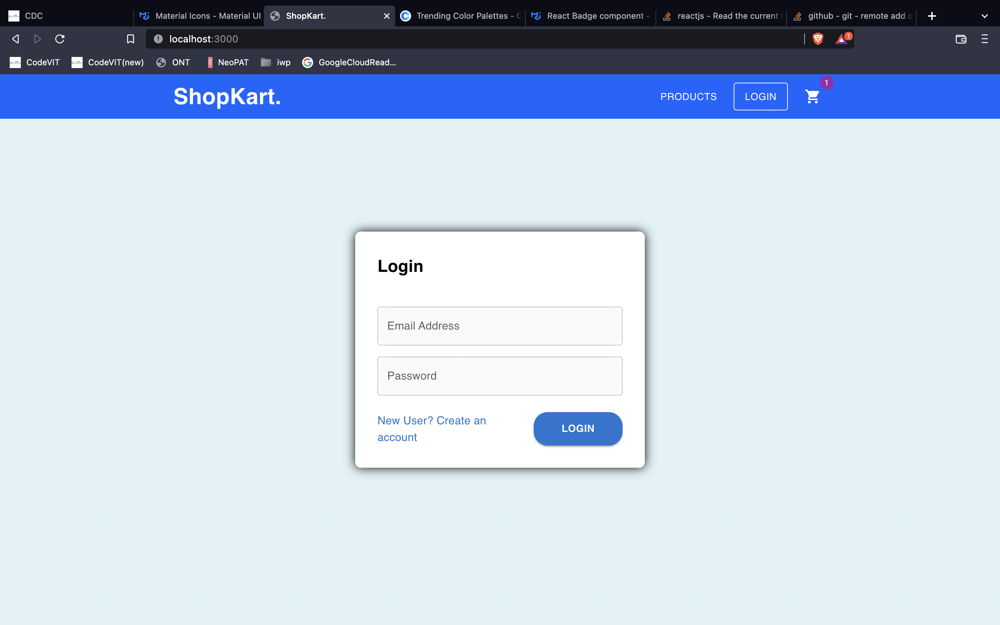
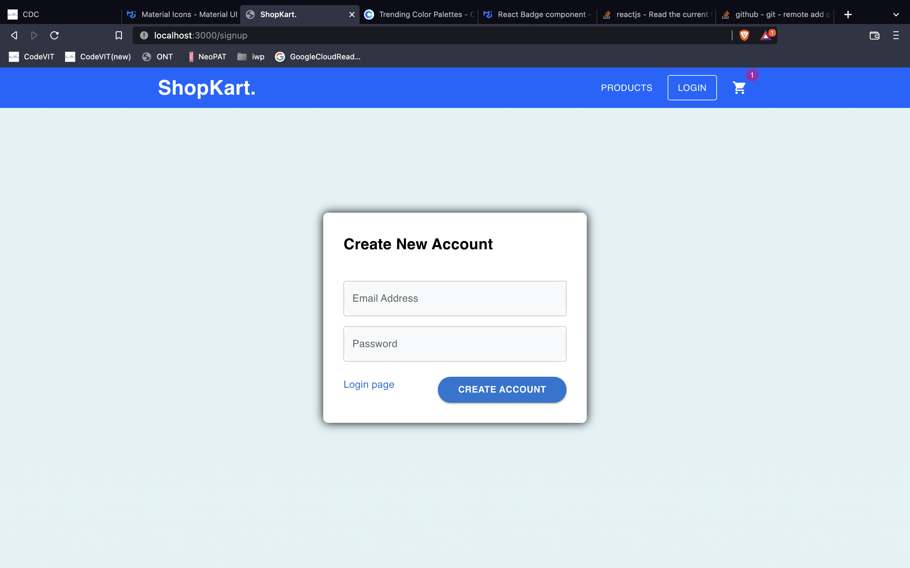
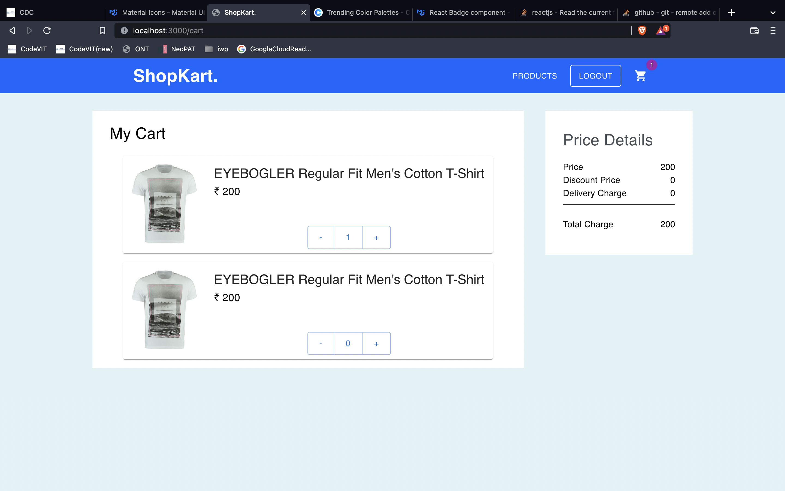

# Ecommerce (React) Coding Assessment

## Overview

Create an Ecommerce web app Frontend.


## Functionalities
- Login and Signup page implemented
- Product Page implemented
- Product Detailed page are connected to Product Page
- Cart Page implemented
- Login and Logout Feature implemented
- Add to favourite on Product Detailed page feature implemented
- Routes are implemented with the help of React-router-dom


## How should the application work?

Workflow : 

1. Login page.
    ``` 
        Testing credentials :
        email : testing@xyz.com
        password: 123456789
    ```
2. Once the user is authenticated from Login ```/```-> redirected to ```/products``` page.
3. Users can move from ```Products Page (/products)```  to ```Product Detail Page (/products/:id)```.
4. Also user can add Product to their favourite products by clicking on ```Heart symbol```.
5. Click on ```Cart Symbol``` in Navbar will redirect the user to ```Cart Page``` .
6. Click on ```LOGOUT``` Button redirect to ```Login``` Page .

## Development Setup

- Clone this repo
- `npm install` - To install the dependencies
- `npm run server` - To start the JSON server
- `npm run start` - To start the react app

## Project ScreenShot.

### Login page



### Register page



### Home page


### Product detail page


### Cart page




